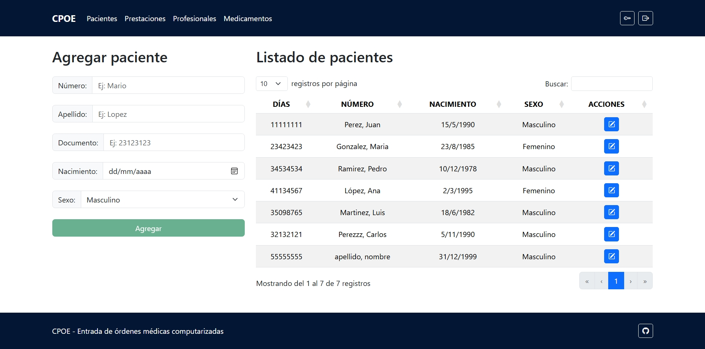
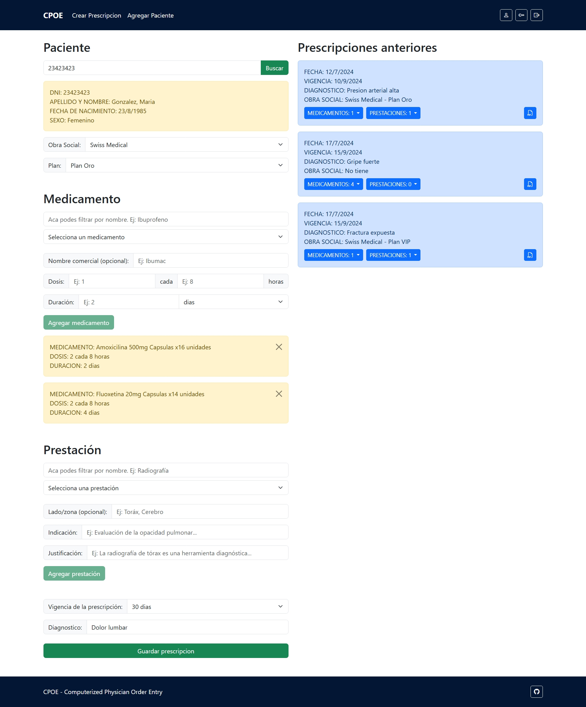

# CPOE
Esta aplicación web permite a médicos autenticados generar prescripciones electrónicas de manera rápida, completa y segura. El sistema está diseñado para registrar medicamentos y prestaciones médicas, incluyendo todos los datos requeridos por normativa, tanto del profesional como del paciente.

## Tecnologías utilizadas
- Node.js
- Express
- MySQL
- Bootstrap
- Pug

## Características
- Autenticación de profesionales médicos.
- Gestión de pacientes, profesionales, prestaciones y medicamentos.
- Prescripción electrónica de medicamentos y/o prestaciones.
- Visualización de prescripciones anteriores.
- Registro de observaciones o resultados sobre prestaciones pasadas.
- Impresión de prescripciones con todos los datos requeridos en pdf.

## Credenciales de prueba
Administración:
- Usuario: `admin`
- Contraseña: `admin`

Profesional:
- Usuario: `12345678`
- Contraseña: `12345678`

## Vista previa

###

###

###

###

###